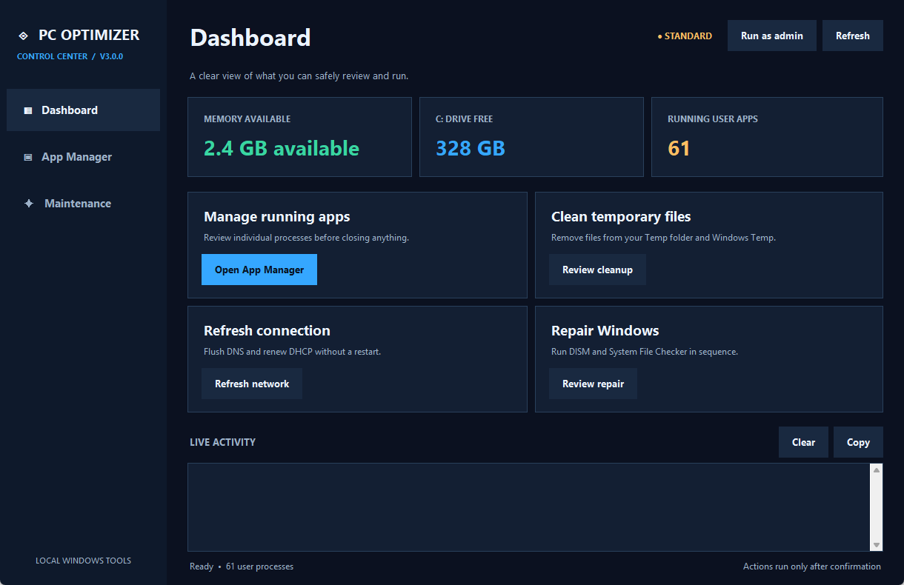
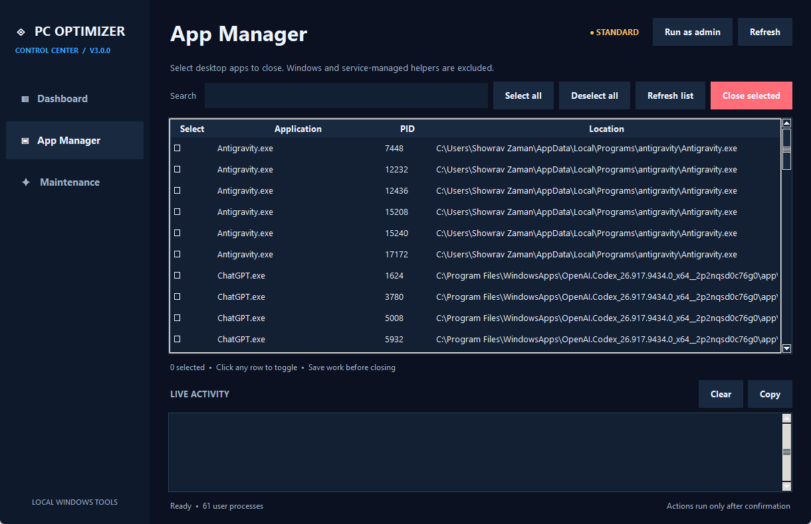
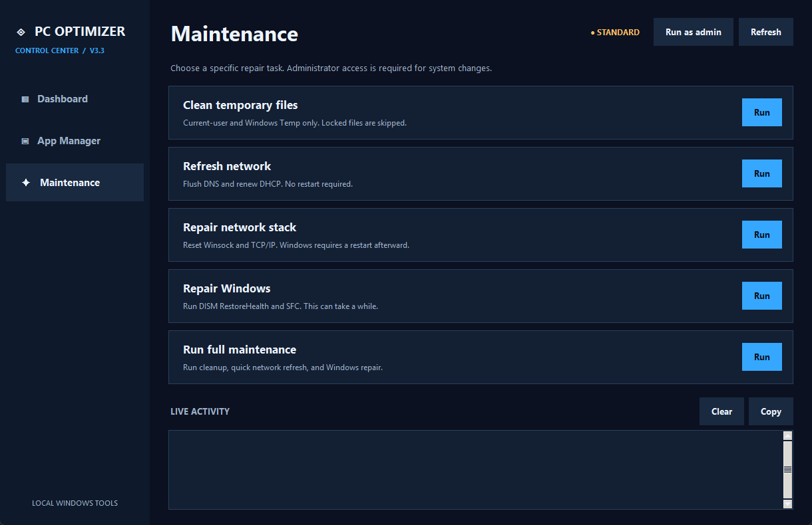

# PC Optimizer 3.0.0

PC Optimizer 3.0.0 is a Windows desktop control center built with Python and Tkinter. It has a Dashboard, App Manager, Maintenance page, and live activity log visible throughout the app.

## Preview

### Dashboard



| App Manager | Maintenance |
| --- | --- |
|  |  |

## Features

- View available memory, free disk space, and the number of running user apps.
- Search running non-Windows apps, select rows directly, or use Select all and Deselect all before closing.
- Show standalone apps in the current desktop session, excluding Windows-hosted and service-managed helpers that automatically restart.
- Report apps that exited before their close request separately from apps Windows could not close.
- Clean the current user's Temp folder and Windows Temp. Locked items are skipped.
- Refresh DNS and DHCP without a restart, or choose a separate Winsock/TCP repair that requires a Windows restart.
- Repair Windows with DISM RestoreHealth and SFC.
- Run cleanup, quick network refresh, and Windows repair in sequence.
- Read, copy, or clear the activity log without leaving the current page.
- Report a partial TCP/IP reset clearly if Windows denies a protected setting after other settings succeed.

Maintenance changes require administrator access and confirmation. Closing selected apps can discard unsaved work. The app never closes apps automatically as part of full maintenance.

## Run from source

```powershell
python pc_optimizer_app.py
```

## Build

```powershell
python -m pip install -r requirements.txt
python -m PyInstaller --noconfirm "PC Optimizer v3.0.0.spec"
```

The Windows executable is produced at `dist/PC Optimizer v3.0.0.exe`.
